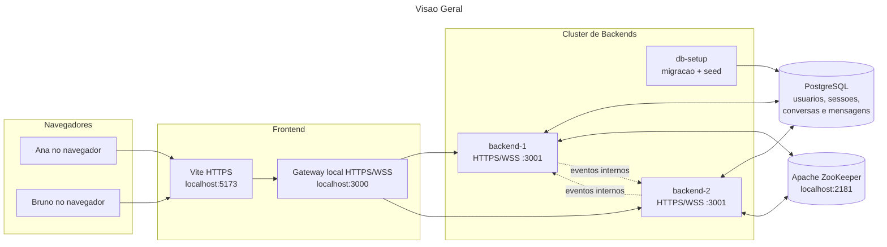
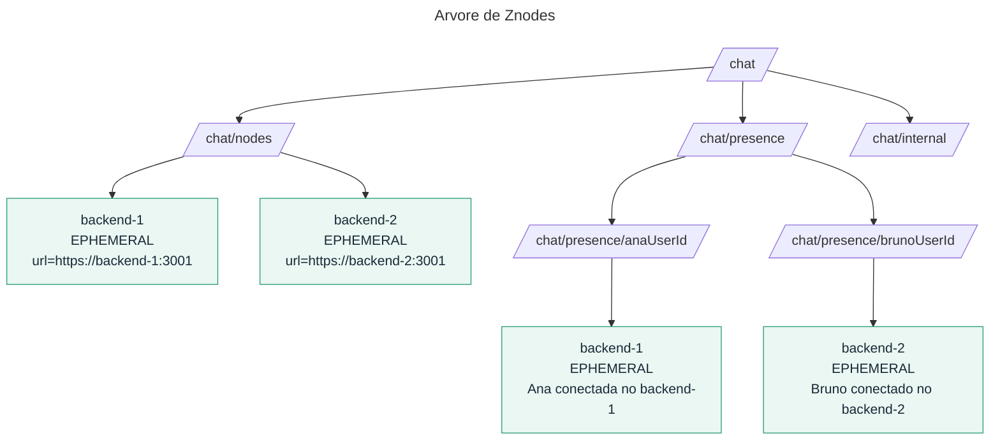
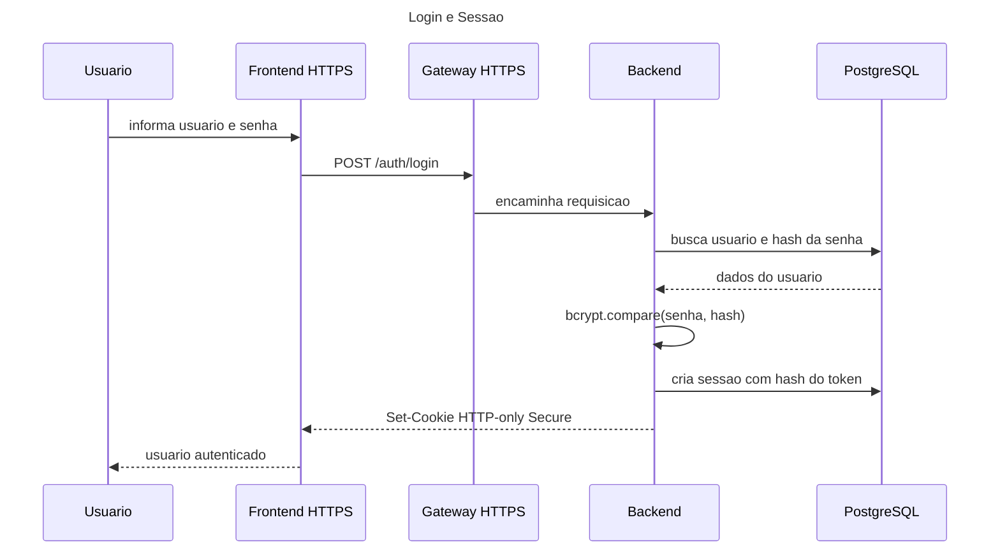
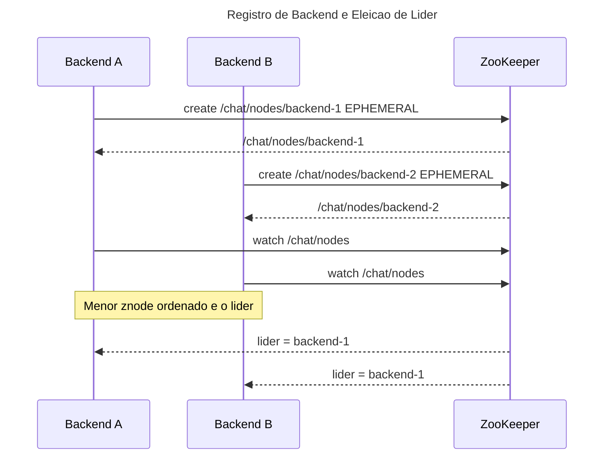
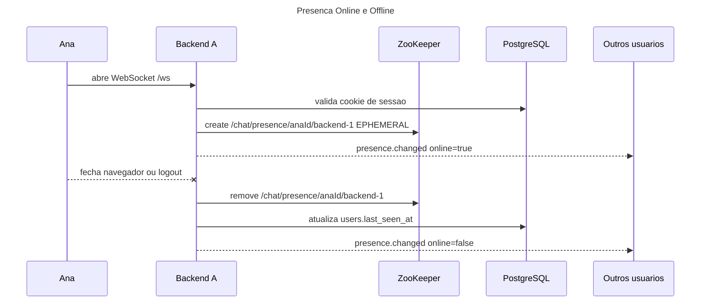
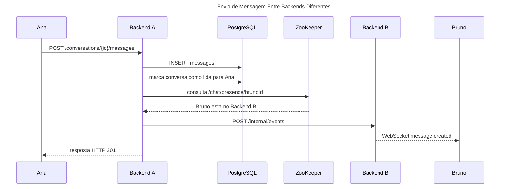
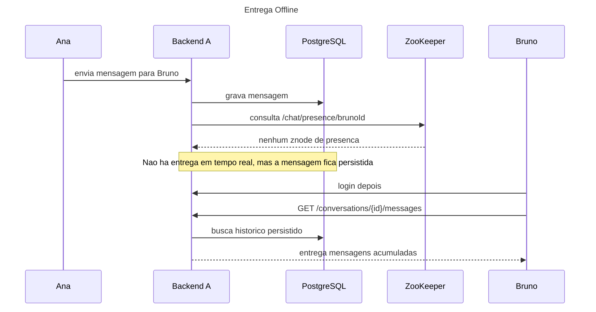
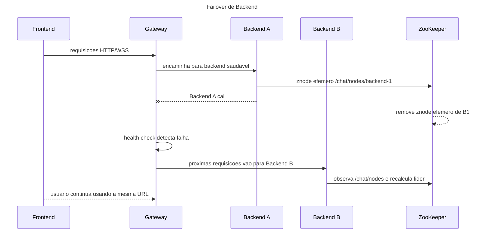
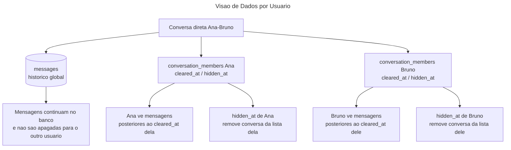
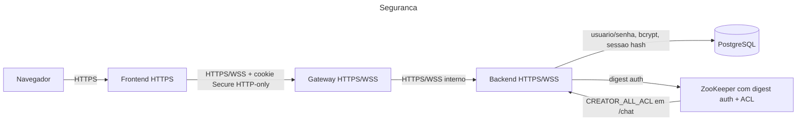

# Diagramas da Arquitetura

Os diagramas abaixo usam Mermaid e podem ser visualizados em editores que
suportam Markdown com Mermaid, como GitHub, GitLab, Obsidian ou extensoes do
VS Code.

Para exportar imagens com nomes de arquivo previsiveis, use:

```powershell
.\docs\export-diagrams.ps1
```

O script gera arquivos em `docs/generated-diagrams`, seguindo a ordem e o nome
das secoes deste documento.

## Visao Geral



## Arvore de Znodes



## Login e Sessao



## Registro de Backend e Eleicao de Lider



## Presenca Online e Offline



## Envio de Mensagem Entre Backends Diferentes



## Entrega Offline



## Failover de Backend



## Visao de Dados por Usuario



## Seguranca


